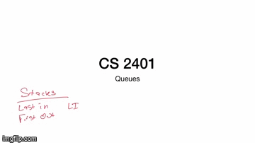

# Week 14

You will build both stacks and queues. 
You will use an array as your storage container for a set of `String`s, and your classes `myStack` and `myQueue` will be given a size limit when they are constructed. 
For a refresher about stacks and queues and thier implementation using arrays see the Stacks and Queues playlist on [YouTube](https://www.youtube.com/playlist?list=PLG9iEq01LJPVOyIMy7w_WBgqHsIksh2U0). 

## What to build
Your taks will be to construct two new classes `myStack` and `myQueue` with the following descriptions. 
`myStack.java` and `myQueue.java` have been created for you in the `src` folder, **do not modify the method and element signatures or access specifiers (i.e. public, private) provied**. 
You can add additional helper methods if neccesary, but these will not be required or graded. 

### `myStack`
Your class should contain the following elements:
* `private String[] data` -- this will be used to hold all of the information in the stack
* `private int top` -- this will hold the index *after* the last element stored in `data`. (If `top == 0` there are no elements in the data structure.)

Your class should have the following constructors:
* `myStack(int size)` -- creates a new instance with `data.length == size`.
* `myStack()` -- created a new instance so `data.length == 10`.

You class will have the following methods:
* `public boolean push(String s)` -- pushes an element into the stack at `top` and increments the pointer. If `top` is out of bound and the element cannot be inserted return false, otherwise return true. 
* `public String pop()` -- pops the top element in the data structure (i.e. the one at `end-1`) and updates the value of `end`. Return `null` if no elements are in the stack. 

### `myQueue`
Your class should contain the following elements:
* `private String[] data` -- this will be used to hold all of the information in the stack.
* `private int front` -- this will contain the index of the front element of the queue.
* `private int numElements` -- keeps track of how many elements are currently in the queue.

Your class should have the following constructors:
* `myQueue(int size)` -- creates a new instance with `data.length == size`.
* `myQueue()` -- created a new instance so `data.length == 10`.

You class will have the following methods:
* `public boolean enqueue(String s)` -- adds `s` to the end of the queue and increments `numElements`. The location to insert the element will be determined based on the position of `front` and the value `numElements` (you will need to use modulus, `%`). This method returns `true` if the element is added, and `false` if the element cannot be added because the queue is full. 
* `public String dequeue()` -- dequeues the front element in the data structure (i.e. the one at `front`) and updates the value of `front`. Returns `null` if there is nothing to dequeue.

### both `myStack` and `myQueue`
Both classes will contain the following methods, though the implementations will be slightly different. 
* `public int getSize()` -- returns the number of elements in the data structure. 
* `public boolean isEmpty()` -- returns `true` if no elements are present in the data structure, returns `false` otherwise.
* `public boolean isFull()` -- returns `true` if the number of elements in the data structure is equal to the size of `data`.

## What to turn in
You will submit 3 files:
* `myStack.java`, 
* `myQueue.java`, and
* `tester.java` which will thoroughly test both data structures. 

## Grading
**190 points total**
* `myStack.java` -- 45 pts.
  * constructors -- 10 pts.
  * `push` -- 10 pts.
  * `pop` -- 10 pts.
  * `getSize`,`isEmpty`,`isfull` -- 5 pts. each
* `myQueue.java` -- 45 pts.
  * constructors -- 10 pts.
  * `enqueue` -- 10 pts.
  * `dequeue` -- 10 pts.
  * `getSize`,`isEmpty`,`isfull` -- 5 pts. each
* `tester.java` -- 10 pts

## Due Date 
You assignment should be submitted on GitHub by **Sunday, 6 December 2020, midnight**. 
Lateness: -10 pts. 1 day late. -20 pts. 2 days late, 0 credit after. 

## Reccomended Schedule
* Monday, 23 November
  * test cases
  * stack & queue constructors
* Wednesday, 25 November
  * rest of the methods
* Monday, 30 November
  * final testing
